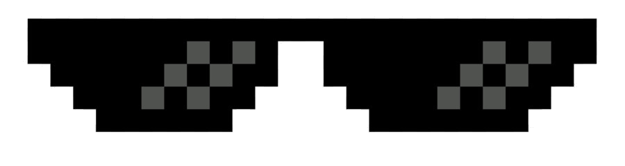

<p align="center">
  <a href="#"></a>
</p>
<h3 align="center">Bringing the dankest memes straight to your terminal 🤖🔥</h3>

## Features 
- Instantly fetch memes from popular sources.  
- View memes directly in your terminal for a seamless coding experience. 
- Stay updated with the latest and greatest memes without ever leaving your coding environment. 

## Usage
1. Clone the repository:
   ```bash
   git clone https://github.com/imaarov/meme.js.git
   ```
2. Install dependencies:
   ```bash
   npm i
   ```
3. Compile the project:
    ```bash
   tsc --project . 
   ```
4. Or use the ready js compiled files:
    ```bash
   node dist/index.js 
   ```

### License

See the [LICENSE](#) file for licensing information, and our [FAQ](#) for any questions you may have on that topic.

